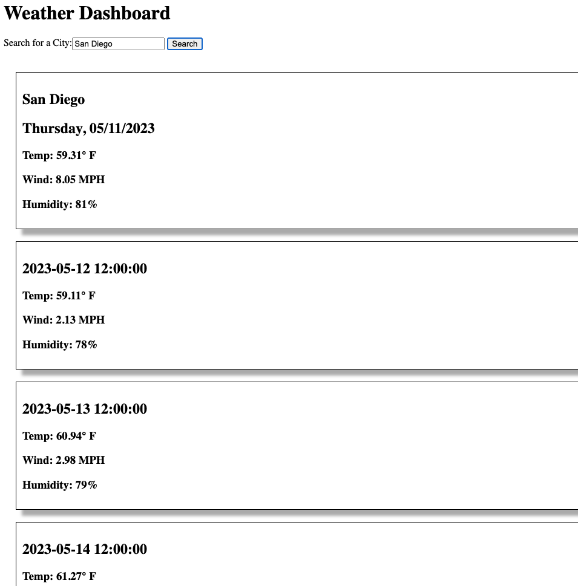

# Weather Dashboard
> This is a weather dashboard that will run in the browser and feature dynamically updated HTML and CSS.  The 5 Day Weather Forecast on OpenWeather was used to retrieve the weather data for searched cities.  An API key was generated to retrieve the data.
> Live demo [_here_](https://kristinehkim.github.io/weather-dashboard/). <!-- If you have the project hosted somewhere, include the link here. -->

## Table of Contents
* [General Info](#general-information)
* [Technologies Used](#technologies-used)
* [Features](#features)
* [Screenshots](#screenshots)
* [Usage](#usage)
* [Project Status](#project-status)
* [Room for Improvement](#room-for-improvement)
* [Acknowledgements](#acknowledgements)
* [Contact](#contact)
<!-- * [License](#license) -->

## General Information
The user can choose a particular city to find weather information.  Once a city is typed in the search box, the current weather and a 5 day forecast of the weather for that city will be displayed.  For each day, the temperature, wind speed, and humidity will be displayed, as well.  All cities searched will appear in a search history below.
<!-- You don't have to answer all the questions - just the ones relevant to your project. -->

## Technologies Used
- OpenWeather
- Postman API Platform

## Features
- Search for weather of chosen city
- Displays current weather
- Displays a 5 day forecast of weather

## Screenshots

<!-- If you have screenshots you'd like to share, include them here. -->

## Usage
The user will type a city name in the search box.  Once the search button is clicked, it will display current weather and a future weather conditions.

## Project Status
Project is: _in progress_.

## Room for Improvement
Room for improvement:
- Clickable links for each city in the search history
- Stlying needs to be improved
- Dates on 5 day forecast needs to be fixed and get rid of time

To do:
- Add links and eventListeners for cities in the search history
- CSS/Bootstrap styling
- Dayjs and slice to fix the date and time

## Acknowledgements
- Many thanks to my instuctor, Michael Pacheco, the TAs, Nirav Venkatesan and Julius Dorfman, and tutor, Dane Shrewsbury. Also, to all the Ask BCS people that helped me!

## Contact
Created by Kristine Kim.  Feel free to email me at kristinehkim@gmail.com. 

<!-- Optional -->
<!-- ## License -->
<!-- This project is open source and available under the [... License](). -->

<!-- You don't have to include all sections - just the one's relevant to your project -->